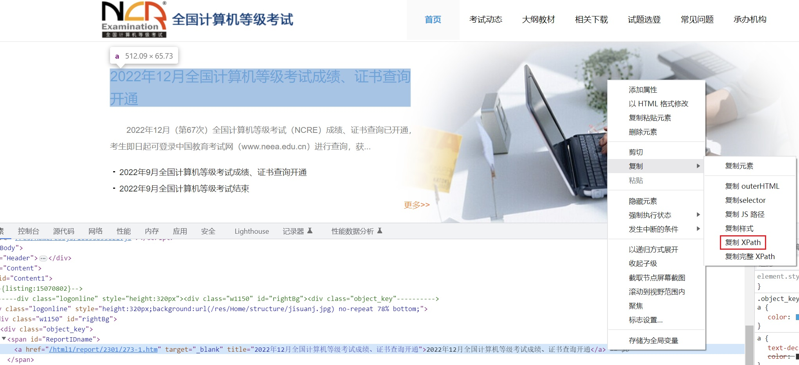

# RssNotifier


RssNotifier是一个RSS邮件提醒工具，主要用于跟踪网站更新的内容，然后通过邮件进行推送。

## 下载

https://github.com/YangGerald/RssNotifier/releases/latest

## 用法

1.下载并安装[RssNotifier](https://github.com/YangGerald/RssNotifier/releases/latest)。

2.在桌面右击“此电脑”，依次点击“属性->高级系统设置->环境变量”，在系统变量中找到“Path”变量并添加RssNotifier的文件路径。

3.登录邮箱，然后在设置中开启SMTP服务，此过程会获得一个授权码，是用于登录第三方邮件客户端的专用密码。

4.配置SMTP服务。

```bash
RssNotifier config --server=smtp.163.com --port=25 --username=from-example@163.com --password=JIFTBJDEVNTYUOVA --receiver=to-example@qq.com
```

- `--password`参数值为邮箱的授权码。

5.添加源。

```bash
RssNotifier add --name=全国计算机等级考试 --url=https://ncre.neea.edu.cn/ --type=html --rule=//*[@id='ReportIDname']/a
```

- `--type`参数值分别有`html`、`atom`、`rss`，`html`类型需要和`--rule`参数一起使用。

- `--rule`参数值为XPath表达式，可以通过浏览器进行复制，但有的仍需要简单的调整一下，如果表达式包含双引号`"`请替换成单引号`'`。



6.读取源。

```bash
RssNotifier read
```

7.新建RssNotifier.bat文件，在文件添加`RssNotifier read`命令，然后创建文件快捷方式并复制到“启动”文件夹，这样每次电脑开机订阅有更新时就会收到邮件提醒了。

## 致谢

感谢[icon-small](https://www.flaticon.com/authors/icon-small)提供的图标，还有其他叫不出名字的朋友。

## 许可证

[MIT](LICENSE)
